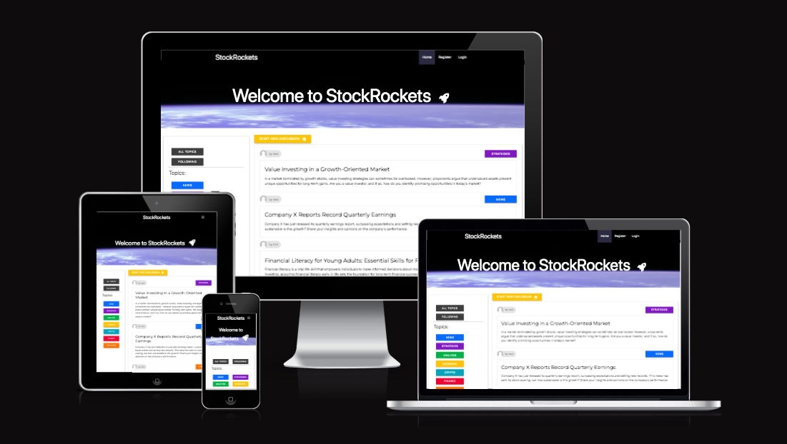
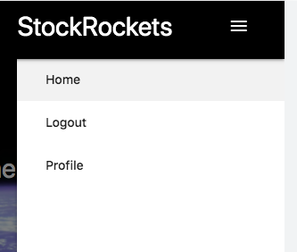
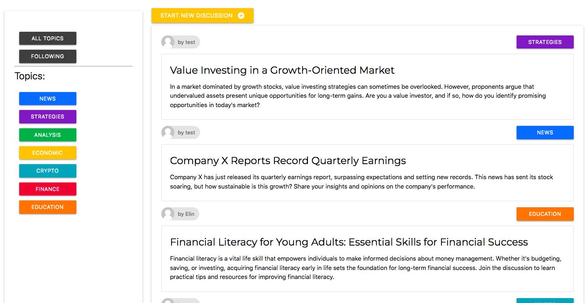
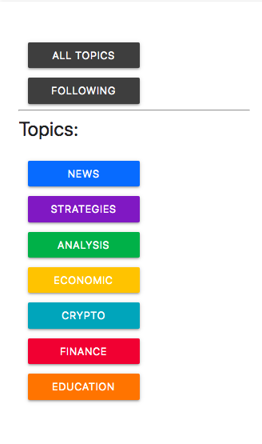

# Stock Rockets Forum

Stock Rockets is an online forum dedicated to discussions surrounding various economic topics, catering to individuals interested in news, strategies, analysis, economics, cryptocurrencies, finance, and education related to the financial world.

This repository hosts the codebase for Stock Rockets, providing users with a platform to engage in insightful conversations, share knowledge, and stay updated on the latest trends and developments in the realm of economics and finance.

Visit the deployed site: [Stock Rockets Forum](link goes here)

## Site Owner Goals for Stock Rockets Forum

**1. Facilitate Engaging Discussions:**
Foster an environment where users can engage in meaningful discussions, exchange ideas, and broaden their understanding of economic concepts across various topics.

**2. Provide Accessible Information:**
Ensure users have easy access to reliable information, news updates, and analytical insights on economic trends, strategies, and financial markets.

**3. Seamless User Experience:**
Design a user-friendly interface that prioritizes intuitive navigation, smooth functionality, and responsiveness across different devices, enhancing the overall user experience.

**4. Foster Community Interaction:**
Encourage community interaction by enabling users to connect with like-minded individuals, follow discussion threads, and actively participate in building a vibrant community centered around economic discourse.

**5. Empower Learning and Growth:**
Empower users to expand their knowledge, refine their strategies, and stay informed about the dynamic landscape of economics and finance through educational resources, expert insights, and peer-to-peer learning opportunities.

## User Experience (UX)

### User Stories

#### First-time User

- As a first-time user, I want to explore the diverse range of economic topics discussed on Stock Rockets and understand how the forum can enrich my understanding of finance and economics.
- As a first-time user, I expect the forum to be easy to navigate, allowing me to quickly find relevant discussions and participate without facing any hurdles.
- As a first-time user, I prefer to browse the forum without the need for immediate registration, enabling me to gauge the quality of discussions and content before committing to sign up.

#### Returning User

- As a returning user, I aim to stay updated on the latest discussions and news in my areas of interest within the economic sphere.
- As a returning user, I want to easily access previously followed threads and pick up where I left off in ongoing conversations.

#### Dedicated User

- As a dedicated user, I seek opportunities to actively contribute to discussions, share insights, and engage with fellow members to enrich the community experience.
- As a dedicated user, I'm interested in receiving notifications or updates about new discussion threads, replies to my comments, and other relevant activities within the forum.

## Design

### Colour Scheme

In designing the color scheme for Stock Rockets, the following colors were carefully selected to ensure a cohesive and visually appealing interface:

- **Start New Discussion Button (#FFC500):** This vibrant yellow color provides a distinct highlight for the "Start New Discussion" button, drawing attention to this important action.

- **User Displaying Author for Thread (Shades of Gray):** Different shades of gray (#B7B7B7, #C6C6C6) are utilized to display the author of a thread, ensuring clear visibility while maintaining a subtle and consistent aesthetic.

- **All Topics and Following Buttons (Shade of Gray):** The buttons for all topics and following threads adopt a consistent shade of gray (rgb(62, 62, 62)), providing uniformity throughout the forum interface.

- **Navigation and Footer (Black Text on White Background):** The navigation and footer sections feature black text on a white background, ensuring readability and contrast.

- **Active Style for Navigation (Space Cadet):** Active navigation items are styled with a shade of blue (rgba(151, 159, 230, 0.274)), reminiscent of the space theme of Stock Rockets.

- **Materialize Green Color for Buttons:** Buttons such as "Sign In," "Register," "Delete," and "Edit Comment" adopt the Materialize green color, maintaining consistency with the framework and enhancing user familiarity.

This color scheme was created by [Coolors](https://coolors.co/).

### Typography

*Google Fonts was used to import the fonts.*

The following fonts were chosen to complement the design aesthetic and ensure readability across the forum interface:

- **Headings (Font: Montserrat, sans-serif):** Montserrat font is used for headings, providing a modern and elegant appearance that aligns with the forum's style.

- **Main Text (Font: Open Sans, sans-serif):** Open Sans font is utilized for main text, offering clarity and readability for prolonged reading sessions.

## Wireframes

Wireframes were produced using Balsamiq. These wireframes were created prior to the project, serving as a conceptual representation of the forum's layout and features. Please note that they may not precisely reflect the final project, as some elements and features are subject to change or implementation. Additionally, the wireframes include placeholders for future features intended to be implemented in subsequent iterations of the project.

 

 
Wireframe

 

## Features

### Header

The homepage features a header showcasing imagery of the earth and outer space, symbolizing the essence of Stock Rockets and conveying the notion of *the sky is the limit*.

### Navigation Bar

The navigation bar is transformed into a hamburger icon, which reveals a side slide-out menu on smaller screens. An active class is dynamically assigned to the page the user is currently on, displaying a blue/violet color on larger screens and a gray color on the mobile menu.

The navigation bar adapts based on whether the user is signed in or not.

#### When Not Signed In:

#### When Signed In:

<h3 style="text-decoration: underline;">Home Page</h3>

### Thread Display

The main content area of the home page features a list of discussion threads, providing users with easy access to ongoing conversations. Each discussion thread is presented in a card panel format, containing the following information:

- **Author's Name:** The name of the user who authored the thread.
- **Topic:** The topic under which the thread is categorized.
- **Thread Title:** The title of the discussion thread.
- **Thread Text:** A brief excerpt or summary of the thread content.

Users can interact with the discussion threads by clicking on the thread title, which redirects them to the full thread details page, where they can view the complete discussion and participate in the conversation.

### Topic Buttons

The topic buttons on the page serve a dual purpose:

1. **Visual Categorization:** Each discussion thread is associated with a specific topic, visually indicated by the topic buttons. These buttons provide an appealing way of displaying which topic a thread is categorized under, allowing users to quickly identify the subject matter of each discussion.

2. **Filtering Threads:** When a user clicks on a specific topic button, the page dynamically filters and displays only those discussion threads that are categorized under the selected topic. This functionality enables users to focus on discussions related to their areas of interest.

Additionally, a special "All Topics" button is provided, allowing users to reset the topic filter and display all discussion threads regardless of their categorization. This ensures that users have the option to browse discussions across all topics whenever desired.

*Here are the topic buttons displayed*:

*Here is a demonstration of threads filtered by the topic "analysis"*:

The buttons also feature hover effects, enhancing user experience by providing visual feedback when users interact with them.

### Modal for Creating New Threads

A modal window is utilized for creating new discussion threads. This modal offers a user-friendly interface for users to input details such as the thread title, text, and select the topic category. The modal appear when the "Start new discussion"-button is clicked.

[]